<div align="center">



<br/>

[](https://git.io/typing-svg)

</div>

<div align="center">
  
</div>

# ✦ About Me

I'm **Nachiketa Sharma**, a second-year Computer Science student at **SRM IST**.

I'm working toward becoming a **Full-Stack Developer** with a strong interest in **Artificial Intelligence, Machine Learning, and Cybersecurity**. My curiosity started with technology itself—from watching hardware reviews to understanding how modern software systems are built—and today I enjoy turning ambitious ideas into products.

### 🌌 Current Orbit

- 🌸 Designing **BLOOM**, an AI-powered School Finder & Education Planner
- 🌐 Strengthening my Full-Stack development foundation
- 🤖 Exploring Artificial Intelligence & Machine Learning
- 🛡 Learning practical Cybersecurity concepts
- 🚀 Building projects that solve real-world problems

<div align="center">
  
</div>

# ☾ Terminal

```bash
nachiketa@github:~$

role
> Aspiring Full-Stack Developer

current_project
> BLOOM

interests
> AIML • Cybersecurity • Product Building

status
> Building. Learning. Shipping.
```

<div align="center">
  
</div>

# ✦ Tech Universe

### Languages

<p align="center">
  
</p>

### Frameworks & Technologies

<p align="center">
  
</p>

### Tools & Platforms

<p align="center">
  
</p>

<text size=sm>
These represent technologies I'm currently using, learning, or building projects with.
</text>

<div align="center">
  
</div>

# 🌸 BLOOM

> *AI-Powered School Finder & Education Planner*

BLOOM is my long-term product vision: helping parents discover schools, compare educational opportunities, and plan their child's learning journey through research-backed insights and personalized recommendations.

### ✦ Flight Path

| Stage | Status |
|-------|--------|
| 🌠 Research | ● Complete |
| 🪐 Planning | ● Complete |
| ✨ Architecture | ◐ In Progress |
| 🚀 MVP | ○ Next |
| 🌌 AI Integration | ○ Future |

<div align="center">
  
</div>

# ✦ Constellation Map

> *A live snapshot of my development journey.*

<p align="center">


</p>

<p align="center">


</p>

<p align="center">


</p>

<div align="center">
  
</div>

# 🛰 Current Mission

- 🌐 Build a strong Full-Stack foundation.
- 🤖 Learn AI & Machine Learning through real projects.
- 🛡 Develop practical Cybersecurity skills.
- 🚀 Turn ambitious ideas into products people actually use.

<div align="center">
  
</div>

# ✦ Let's Connect

<p align="center">

<a href="mailto:nachiketasharma0911@gmail.com">
  
</a>

</p>

<div align="center">

*"The brightest constellations begin as scattered stars."*

✦────────────── ☾ ──────────────✦

**CURRENT ORBIT · BUILDING BLOOM**

</div>
